# Usecase - User
### signup
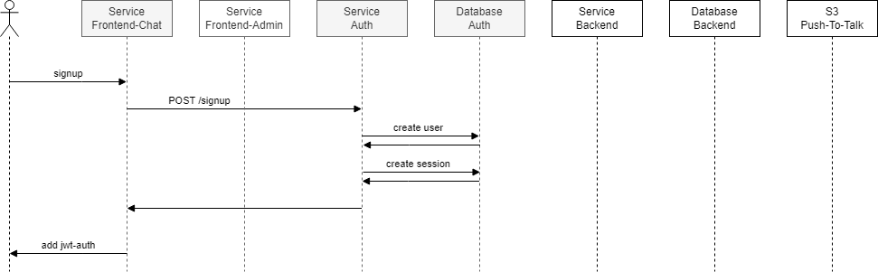

### login
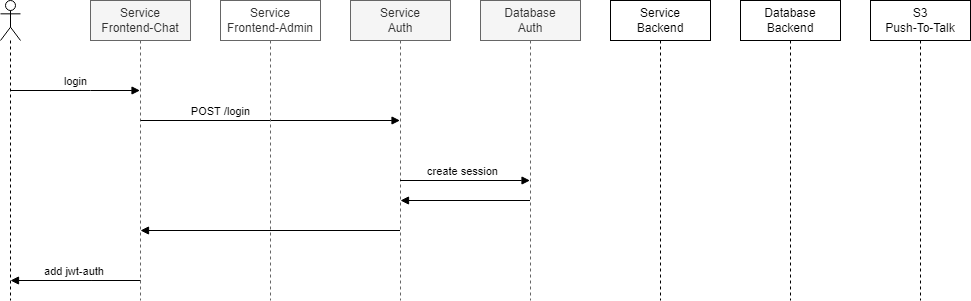

### check-login
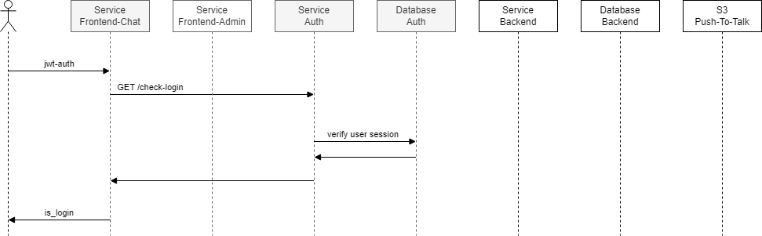

### check-admin
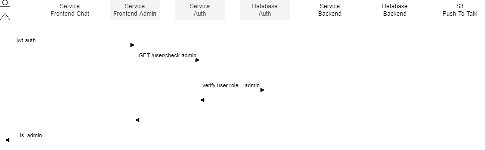

### check-whitelist-push-to-talk
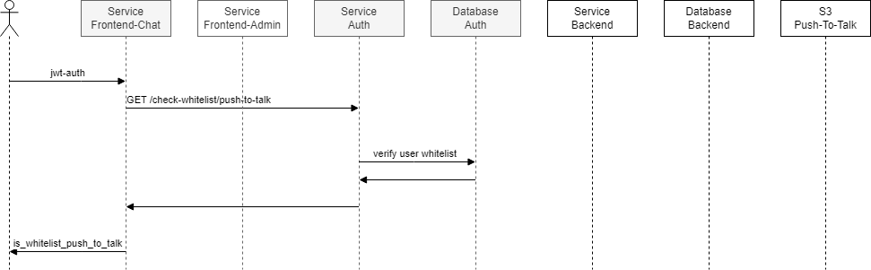

### logout
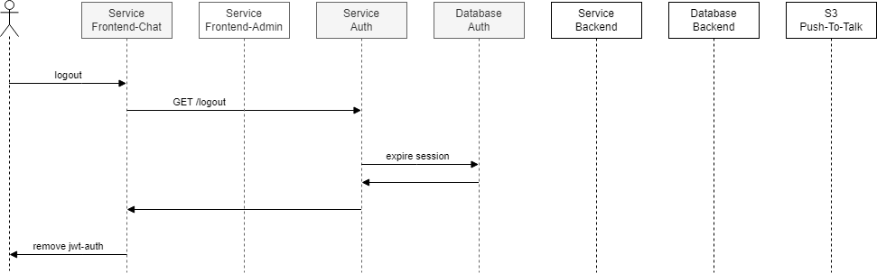

### get-chat
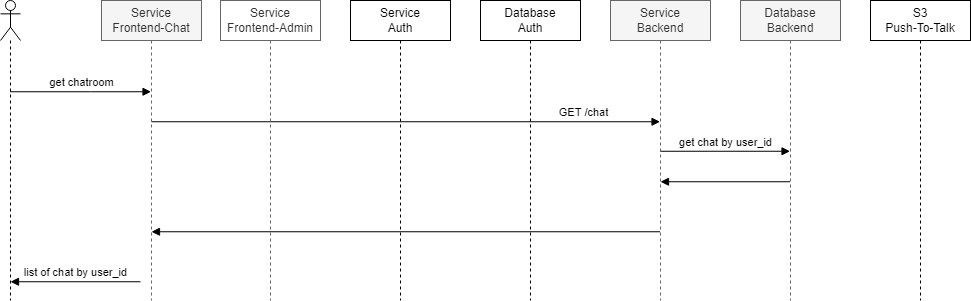

### create-chat
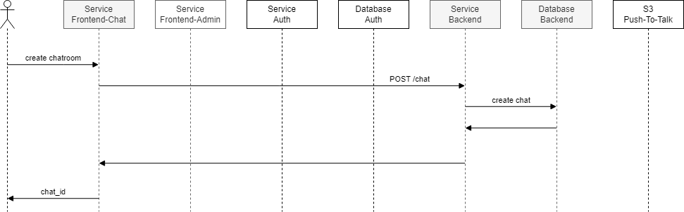

### get-chat-history
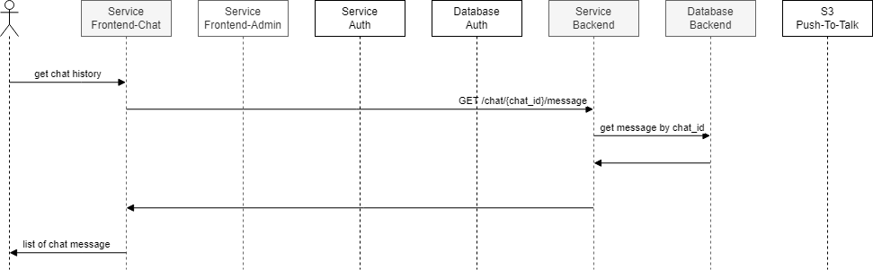

### create-chat-message
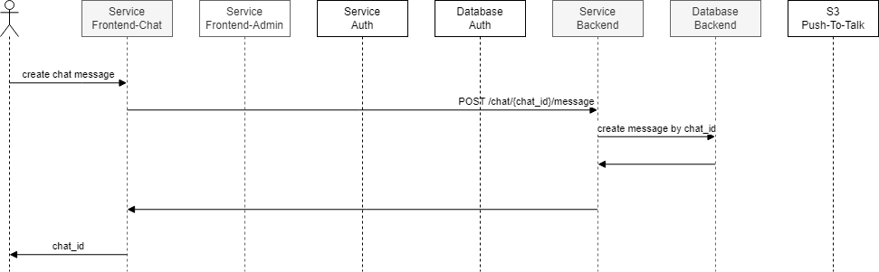

# Usecase - Whitelist User
### get-push-to-talk
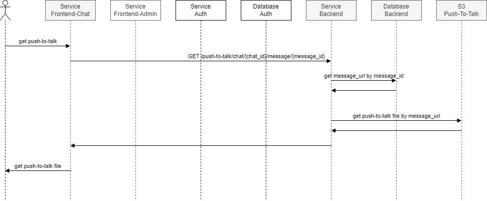

### create-push-to-talk
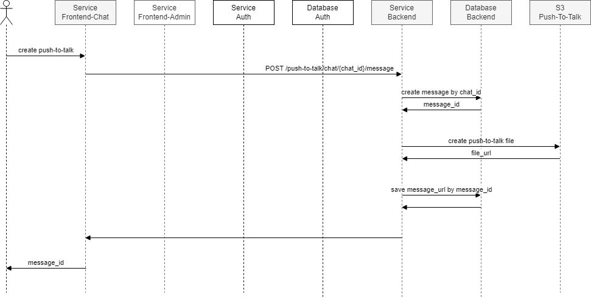

# Usecase - Admin
### get-push-to-talk-report
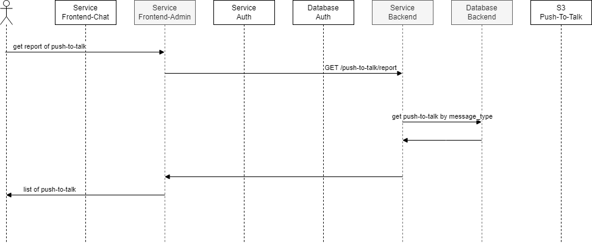

