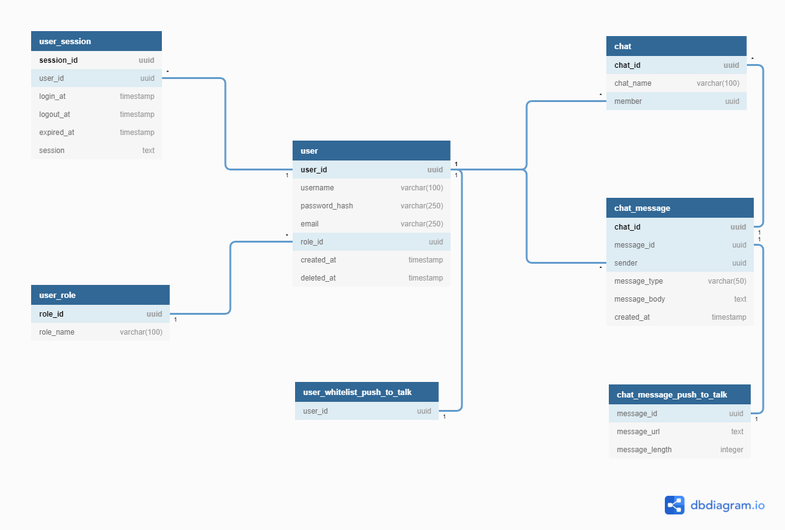

# Database - Auth
### user
- user_id
- username
- email
- password_hash
- role_id
- created_at
- deleted_at

### user_role
- role_id
- role_name (user, admin)

### user_session
- user_id
- login_at
- logout_at
- expired_at
- session (jwt)

### user_whitelist_push_to_talk
- user_id

# Database - Backend
### chat
- chat_id
- chat_name
- member (user_id)

### chat_message
- chat_id
- message_id
- sender (user_id)
- message_type (text, push_to_talk, ..)
- message_body
- created_at

### chat_message_push_to_talk
- message_id
- message_url
- message_length (second, max=60)

# ER Diagram
